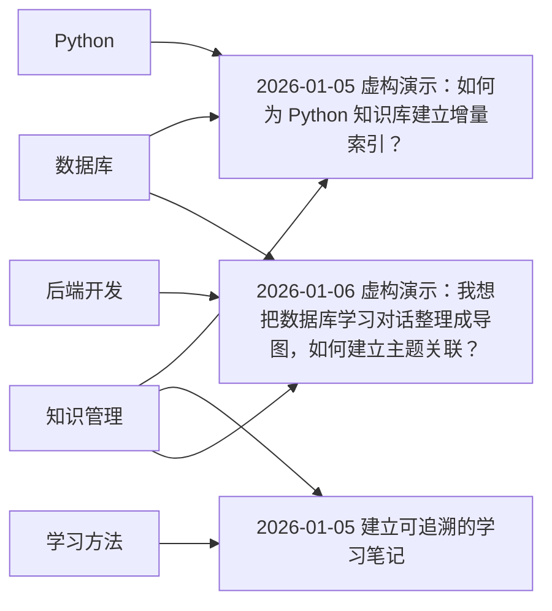

<!-- Generated by knowledge; put handwritten notes in Notes/. -->

# 知识关系图

主题与来源的关联来自摘要主题标签，不能单独证明因果关系。

```mermaid
graph LR
  t18885f27b5af["Python"]
  td7ba2d72a14c["后端开发"]
  td6543d3bdf2e["学习方法"]
  t263200d7d529["数据库"]
  td1af5b6220f7["知识管理"]
  d958102e9137033ab252b9421["2026-01-06 虚构演示：我想把数据库学习对话整理成导图，如何建立主题关联？"]
  td1af5b6220f7 --> d958102e9137033ab252b9421
  t263200d7d529 --> d958102e9137033ab252b9421
  td7ba2d72a14c --> d958102e9137033ab252b9421
  d95e552cbd3a8e8707fa8d70b["2026-01-05 建立可追溯的学习笔记"]
  td1af5b6220f7 --> d95e552cbd3a8e8707fa8d70b
  td6543d3bdf2e --> d95e552cbd3a8e8707fa8d70b
  de65a82d664f94442862f58a3["2026-01-05 虚构演示：如何为 Python 知识库建立增量索引？"]
  td1af5b6220f7 --> de65a82d664f94442862f58a3
  t263200d7d529 --> de65a82d664f94442862f58a3
  t18885f27b5af --> de65a82d664f94442862f58a3
```
