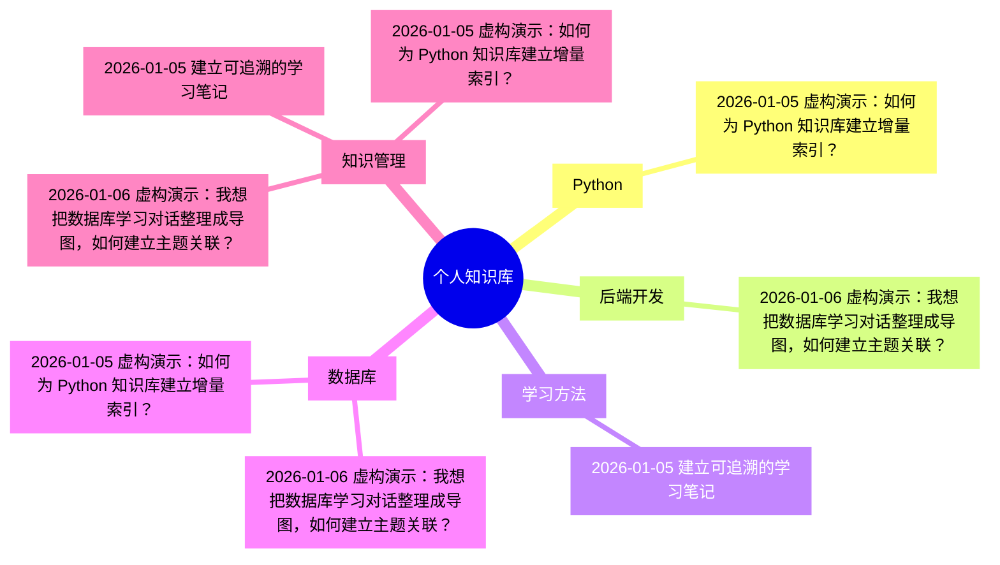

<!-- Generated by knowledge; put handwritten notes in Notes/. -->

# 主题导图

导图展示最近 3 份资料；完整内容见 Wiki 和时间线。

```mermaid
mindmap
  root((个人知识库))
    t18885f27b5af["Python"]
      de65a82d664f94442862f58a3t18885f27b5af["2026-01-05 虚构演示：如何为 Python 知识库建立增量索引？"]
    td7ba2d72a14c["后端开发"]
      d958102e9137033ab252b9421td7ba2d72a14c["2026-01-06 虚构演示：我想把数据库学习对话整理成导图，如何建立主题关联？"]
    td6543d3bdf2e["学习方法"]
      d95e552cbd3a8e8707fa8d70btd6543d3bdf2e["2026-01-05 建立可追溯的学习笔记"]
    t263200d7d529["数据库"]
      d958102e9137033ab252b9421t263200d7d529["2026-01-06 虚构演示：我想把数据库学习对话整理成导图，如何建立主题关联？"]
      de65a82d664f94442862f58a3t263200d7d529["2026-01-05 虚构演示：如何为 Python 知识库建立增量索引？"]
    td1af5b6220f7["知识管理"]
      d958102e9137033ab252b9421td1af5b6220f7["2026-01-06 虚构演示：我想把数据库学习对话整理成导图，如何建立主题关联？"]
      d95e552cbd3a8e8707fa8d70btd1af5b6220f7["2026-01-05 建立可追溯的学习笔记"]
      de65a82d664f94442862f58a3td1af5b6220f7["2026-01-05 虚构演示：如何为 Python 知识库建立增量索引？"]
```
